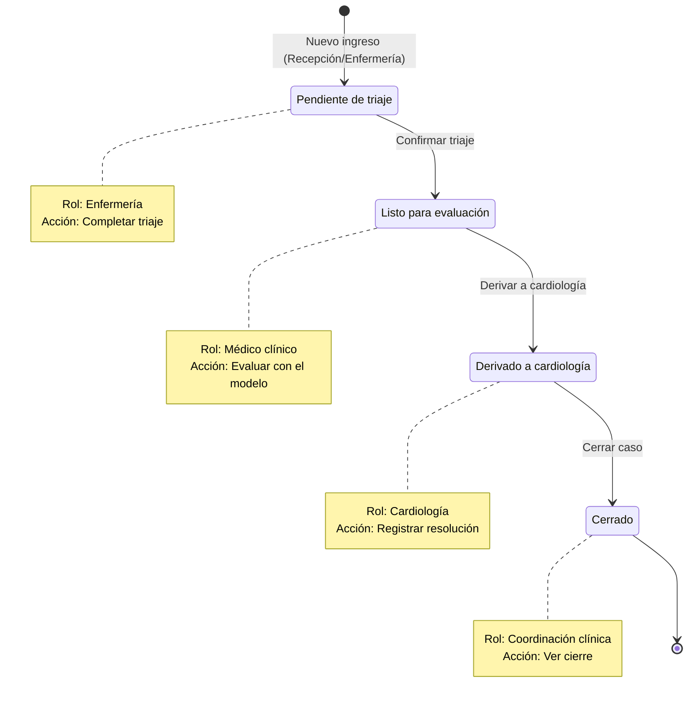

# Flujo Clínico del Paciente - CardioFlow

Este diagrama representa el ciclo de vida de un paciente en el sistema, los roles involucrados y las transiciones de estado.

## Roles y Acciones

1. **Enfermería**: 
   - **Estado:** Pendiente de triaje
   - **Acción:** `Completar triaje`
   - **Transición:** Genera evento "Triaje completado" y avanza a "Listo para evaluación".
2. **Médico Clínico**: 
   - **Estado:** Listo para evaluación
   - **Acción:** `Evaluar con el modelo`
   - **Transición:** Registra la conducta clínica y, si corresponde, deriva el caso a cardiología.
3. **Cardiología**: 
   - **Estado:** Derivado a cardiología
   - **Acción:** `Registrar resolución`
   - **Transición:** Genera evento "Resolución cardiológica registrada" y avanza a "Cerrado".
4. **Coordinación Clínica**:
   - **Estado:** Cerrado
   - **Acción:** `Ver cierre` (Solo lectura, el ciclo finaliza aquí).
